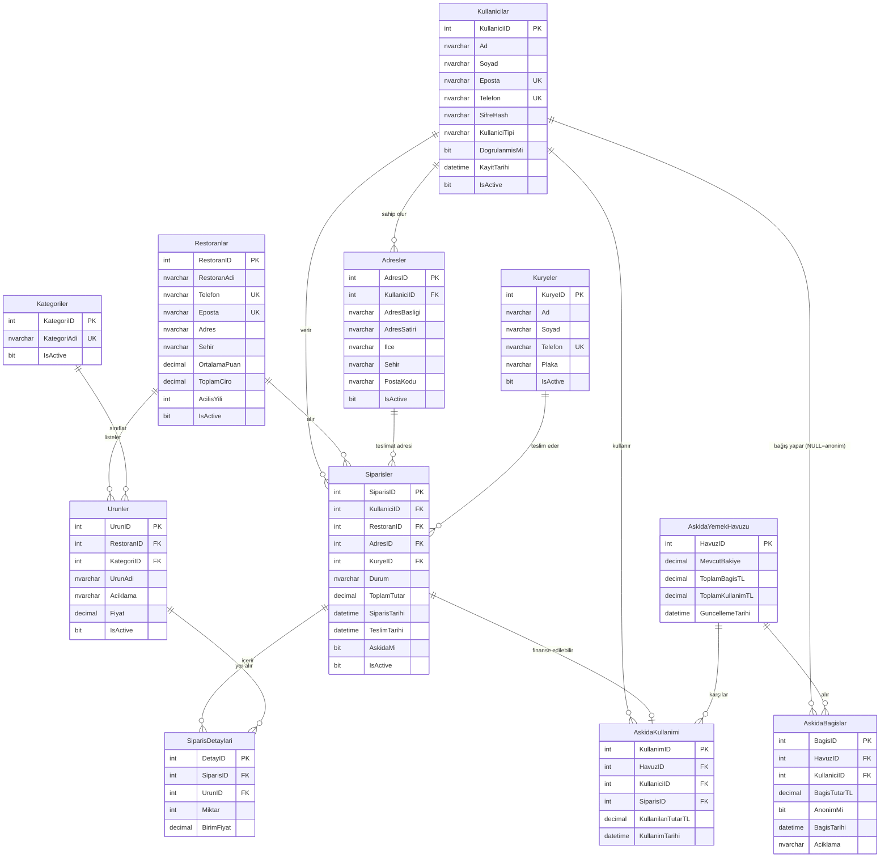

# ER Diyagramı — YemekSiparisDB

## Mermaid ER Diyagramı (dbdiagram.io / draw.io'ya aktarmak için)



---

## Tablo Grupları ve İlişki Özeti

### Kullanıcı Katmanı
```
Kullanicilar (1) ──── (N) Adresler
Kullanicilar (1) ──── (N) Siparisler
Kullanicilar (1) ──── (N) AskidaBagislar   [KullaniciID NULL = anonim]
Kullanicilar (1) ──── (N) AskidaKullanimi
```

### Restoran & Menü Katmanı
```
Restoranlar (1) ──── (N) Urunler
Restoranlar (1) ──── (N) Siparisler
Kategoriler (1) ──── (N) Urunler
```

### Sipariş Katmanı
```
Siparisler   (1) ──── (N) SiparisDetaylari
Urunler      (1) ──── (N) SiparisDetaylari
Adresler     (1) ──── (N) Siparisler
Kuryeler     (1) ──── (N) Siparisler
```

### Askıda Yemek Katmanı
```
AskidaYemekHavuzu (1) ──── (N) AskidaBagislar
AskidaYemekHavuzu (1) ──── (N) AskidaKullanimi
Siparisler        (1) ──── (0..1) AskidaKullanimi  [bir sipariş en fazla 1 kez]
```

---

## Kritik Tasarım Kararları (Savunma Notları)

| Soru | Cevap |
|---|---|
| Neden `SiparisDetaylari` ayrı tablo? | Bir sipariş birden fazla ürün içerebilir. Ürünleri Siparisler tablosuna koysaydık 1NF ihlali olurdu. |
| Neden `AskidaBagislar.KullaniciID` NULL olabilir? | Anonim bağış senaryosunu desteklemek için. AnonimMi=1 ise isim sorgularda gizlenir, KullaniciID NULL olabilir. |
| Neden `AskidaYemekHavuzu` ayrı tablo? | Havuz bakiyesi tek bir merkezi kayıtta tutulur. Trigger'lar bu satırı güncelliyor; dağıtık tutmak veri tutarsızlığına yol açar. |
| `AskidaKullanimi.SiparisID` neden UNIQUE? | Bir sipariş en fazla bir kez Askıda Yemek kapsamında kullanılabilir. |
| `ToplamCiro` neden Restoranlar tablosunda? | Trigger ile otomatik hesaplanıyor. Alternatif: her seferinde SUM sorgusu — performans için dönüştürülmüş kolon tercih edildi. |
| Neden Soft Delete? | Geçmiş siparişlerde fiyat ve referans bütünlüğü korunur. Fiziksel silme FK kısıtlamalarını bozar. |

---

## dbdiagram.io Kodu (Görsel PNG Üretmek İçin)

Aşağıdaki kodu [dbdiagram.io](https://dbdiagram.io) sitesine yapıştırarak görsel ER diyagramı oluşturabilirsin:

```
Table Kullanicilar {
  KullaniciID int [pk, increment]
  Ad nvarchar(50) [not null]
  Soyad nvarchar(50) [not null]
  Eposta nvarchar(100) [unique, not null]
  Telefon nvarchar(15) [unique, not null]
  SifreHash nvarchar(256) [not null]
  KullaniciTipi nvarchar(20) [default: 'Musteri']
  DogrulanmisMi bit [default: 0]
  KayitTarihi datetime
  IsActive bit [default: 1]
}

Table Adresler {
  AdresID int [pk, increment]
  KullaniciID int [ref: > Kullanicilar.KullaniciID]
  AdresBasligi nvarchar(50)
  AdresSatiri nvarchar(200)
  Ilce nvarchar(50)
  Sehir nvarchar(50)
  PostaKodu nvarchar(10)
  IsActive bit [default: 1]
}

Table Kategoriler {
  KategoriID int [pk, increment]
  KategoriAdi nvarchar(50) [unique]
  IsActive bit [default: 1]
}

Table Restoranlar {
  RestoranID int [pk, increment]
  RestoranAdi nvarchar(100)
  Telefon nvarchar(15) [unique]
  Eposta nvarchar(100) [unique]
  Adres nvarchar(200)
  Sehir nvarchar(50)
  OrtalamaPuan decimal
  ToplamCiro decimal
  AcilisYili int
  IsActive bit [default: 1]
}

Table Urunler {
  UrunID int [pk, increment]
  RestoranID int [ref: > Restoranlar.RestoranID]
  KategoriID int [ref: > Kategoriler.KategoriID]
  UrunAdi nvarchar(100)
  Aciklama nvarchar(300)
  Fiyat decimal
  IsActive bit [default: 1]
}

Table Kuryeler {
  KuryeID int [pk, increment]
  Ad nvarchar(50)
  Soyad nvarchar(50)
  Telefon nvarchar(15) [unique]
  Plaka nvarchar(10)
  IsActive bit [default: 1]
}

Table Siparisler {
  SiparisID int [pk, increment]
  KullaniciID int [ref: > Kullanicilar.KullaniciID]
  RestoranID int [ref: > Restoranlar.RestoranID]
  AdresID int [ref: > Adresler.AdresID]
  KuryeID int [ref: > Kuryeler.KuryeID]
  Durum nvarchar(20)
  ToplamTutar decimal
  SiparisTarihi datetime
  TeslimTarihi datetime
  AskidaMi bit [default: 0]
  IsActive bit [default: 1]
}

Table SiparisDetaylari {
  DetayID int [pk, increment]
  SiparisID int [ref: > Siparisler.SiparisID]
  UrunID int [ref: > Urunler.UrunID]
  Miktar int
  BirimFiyat decimal
}

Table AskidaYemekHavuzu {
  HavuzID int [pk, increment]
  MevcutBakiye decimal
  ToplamBagisTL decimal
  ToplamKullanimTL decimal
  GuncellemeTarihi datetime
}

Table AskidaBagislar {
  BagisID int [pk, increment]
  HavuzID int [ref: > AskidaYemekHavuzu.HavuzID]
  KullaniciID int [ref: > Kullanicilar.KullaniciID, null]
  BagisTutarTL decimal
  AnonimMi bit [default: 0]
  BagisTarihi datetime
  Aciklama nvarchar(200)
}

Table AskidaKullanimi {
  KullanimID int [pk, increment]
  HavuzID int [ref: > AskidaYemekHavuzu.HavuzID]
  KullaniciID int [ref: > Kullanicilar.KullaniciID]
  SiparisID int [unique, ref: > Siparisler.SiparisID]
  KullanilanTutarTL decimal
  KullanimTarihi datetime
}
```

> **Adımlar:** dbdiagram.io → sol panele kodu yapıştır → sağda diyagram oluşur → Export → PNG olarak indir → `er_diagram.png` adıyla kaydet.
